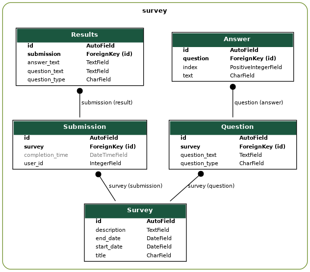

# Survey - Опрос пользователей (Django REST Framework)
---
## Задача: спроектировать и разработать API для системы опросов пользователей.
Функционал для администратора системы:
- авторизация в системе (регистрация не нужна)
- добавление/изменение/удаление опросов. Атрибуты опроса: название, дата старта, дата окончания, описание. После создания поле "дата старта" у опроса менять нельзя
- добавление/изменение/удаление вопросов в опросе. Атрибуты вопросов: текст вопроса, тип вопроса (ответ текстом, ответ с выбором одного варианта, ответ с выбором нескольких вариантов)

Функционал для пользователей системы:
- получение списка активных опросов
- прохождение опроса: опросы можно проходить анонимно, в качестве идентификатора пользователя в API передаётся числовой ID, по которому сохраняются ответы пользователя на вопросы; один пользователь может участвовать в любом количестве опросов
- получение пройденных пользователем опросов с детализацией по ответам (что выбрано) по ID уникальному пользователя

Использовать следующие технологии: Django 2.2.10, Django REST framework.

Результат выполнения задачи:
- исходный код приложения в github (только на github, публичный репозиторий)
- инструкция по разворачиванию приложения (в docker или локально)
- документация по API

## Требования
- [Python](https://www.python.org/downloads/) версия 3.5 и выше
- Установщик пакетов python - [pip](https://pip.pypa.io/en/stable/installing/)

## Установка
Требуется Python версия 3 и выше, установщик пакетов python - pip
```
cd questionnaire
pip install -r requirements.txt
python manage.py makemigrations survey
python manage.py migrate
python manage.py createsuperuser
```
Указываем имя и пароль пользователя, будет использоваться в тестах (см. tests/config.py). По умолчанию odmin/odmin.

## Запуск сервера
```
python manage.py runserver
```

## Запуск тестов
```
cd questionnaire/tests
pytest
```

## Описание API
См. [API.md](API.md)
## Описание схемы данных

